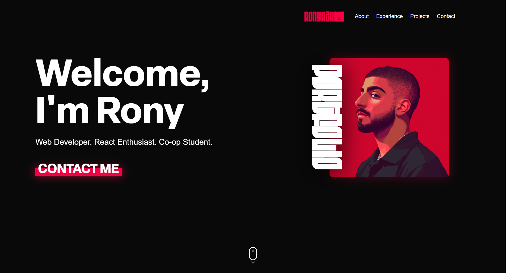

<h1>My React Portfolio</h1>
This repository holds the code for my personal website. THe purpose of the website is to be used as a demonstration and repo of my capabilites as a web developer. It was built using React and Vite, and is powered by the animation framework FramerMotion. It contains the basics of a website such as a navigation, hero page, interactive elements, and a footer. Each project module sends the user to a repository in my GitHub.
 

<a href="ronyazrieh.com">Visit the website now!</a>

 
 

<h3>React</h3>

I used React to create this website and specifcally took advantage of the multitude of installable packages to achieve my goals. These include FramerMotion, Motion, react-router-dom, and react-icons. These packages were used to achieve the final build of this website.

<h3>Netlify</h3>

This website was deployed using Netlify and has its own custom domain. My name. <a href="ronyazrieh.com"> ronyazrieh.com </a>
